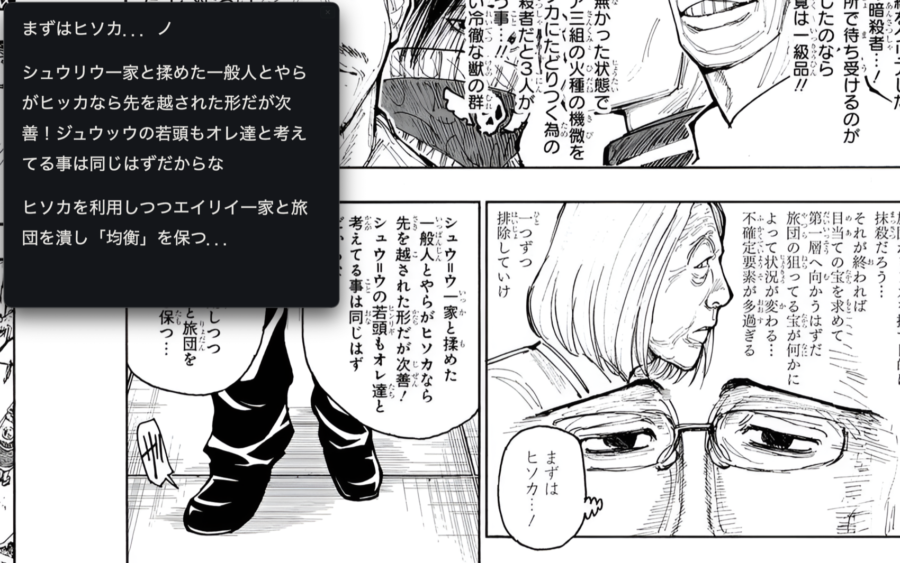
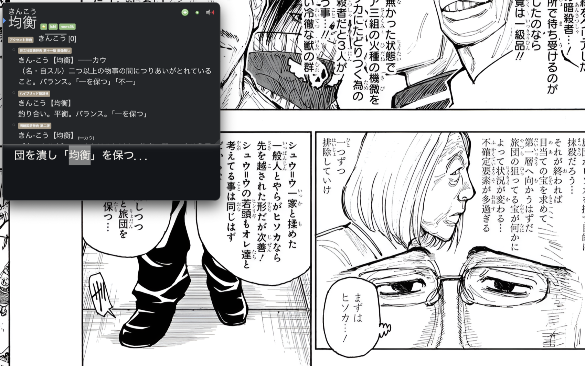

# texthooker-overlay

A frameless, always-on-top texthooker overlay for macOS with the [Yomitan](https://github.com/yomidevs/yomitan) pop-up dictionary built in.

Made for reading manga, visual novels, or games in fullscreen: whenever new Japanese text lands on the clipboard (e.g. from an OCR tool), the overlay pops up over whatever you're reading with the captured line ready for instant Yomitan lookups. Click back on your reading and it disappears again.





*The manga in the screenshots is blurred to avoid reproducing copyrighted artwork — the overlay and the Yomitan popup are what's being demonstrated.*

The reading pane is an Electron-embedded adaptation of [tsukami-texthooker](https://github.com/onweeks/tsukami-texthooker) — use that if you want the standalone browser version.

## How it works

- An Electron accessory app (no Dock icon) creates a frameless window at an elevated window level, marked visible on all workspaces — the combination macOS requires for a window to float above another app's fullscreen Space.
- The main process polls the clipboard every 200 ms and appends each new line to the reading pane, popping the overlay into view when text arrives.
- [Yomitan](https://github.com/yomidevs/yomitan) is loaded as an unpacked Chrome extension into the Electron session, so hovering text in the pane gives full pop-up dictionary lookups.
- The overlay hides on blur (Spotlight-style): clicking anywhere else dismisses it instantly.

## Requirements

- **macOS** — the overlay-above-fullscreen window tricks are macOS-specific.
- Node.js and npm.

## Setup

```sh
npm install
npm start
```

Then import your dictionaries: press <kbd>Cmd</kbd>+<kbd>Shift</kbd>+<kbd>S</kbd> to open Yomitan's settings and add them under *Dictionaries*. Imported dictionaries and settings persist in `~/Library/Application Support/overlay-app/` and survive restarts.

If you already use Yomitan in your normal browser, the easiest route is to carry your setup over instead of starting fresh: in your browser's Yomitan go to *Settings → Backup*, export both your settings and your dictionary collection, then import the two files in this app's Yomitan settings. You end up with identical dictionaries and configuration in one step.

Anki integration works as normal: with [AnkiConnect](https://ankiweb.net/shared/info/2055492159) installed in Anki and enabled in Yomitan's settings, the popup's **+** button adds cards straight to your deck.

## Controls

| Input | Action |
| --- | --- |
| <kbd>Cmd</kbd>+<kbd>Shift</kbd>+<kbd>Y</kbd> | Toggle the overlay from anywhere (global) |
| <kbd>Cmd</kbd>+<kbd>Shift</kbd>+<kbd>S</kbd> | Open Yomitan settings (overlay must be focused) |
| Click outside the overlay | Hide it |
| <kbd>Esc</kbd> | Leave focus mode (it starts enabled — just the text, no toolbar) |
| ✕ (toolbar, top-left) | Quit the app (or <kbd>Ctrl</kbd>+<kbd>C</kbd> in the terminal) |
| Drag the toolbar or the window's left/right edges | Move the window |

The pane itself has the usual texthooker comforts: line log with timestamps, per-line delete, clear all, font sizing, light/dark theme, auto-scroll with a jump-to-new-lines button, manual line entry, and character/line stats. Everything is stored locally.

## Bundled Yomitan

`yomitan-chrome/` is a stock [Yomitan](https://github.com/yomidevs/yomitan) build (GPL-3.0, © the Yomitan developers) with three small patches for Electron's partial `chrome.*` extension API support:

- `electron-polyfill.js` — a shim that fakes the `chrome.permissions` API (loaded by `sw.js` and the settings page), since Electron doesn't implement it.
- `manifest.json` — the `contextMenus` permission is removed (unknown to Electron; it only produced a load warning).
- `js/background/backend.js` — `_createTab` no-ops when `chrome.tabs.create` doesn't exist, instead of throwing at startup.

**If you edit anything under `yomitan-chrome/`:** Chromium caches the extension's service worker, so changes may not take effect until you delete `~/Library/Application Support/overlay-app/Service Worker/` (and optionally `Code Cache/`). Your dictionaries live in `IndexedDB/` and are unaffected.

## Gotchas

- **Don't rename or move the project folder, and don't change `"name"` in package.json.** The extension's identity is derived from its absolute path, and the profile folder from the app name — changing either orphans your imported dictionaries (they're not deleted, but Yomitan will come up empty until you restore the original path/name).
- Occasional `error messaging the mach port for IMKCFRunLoopWakeUpReliable` lines in the terminal are harmless macOS input-method noise, common to all Electron/Chromium apps, and amplified by how often the overlay shows/hides.
